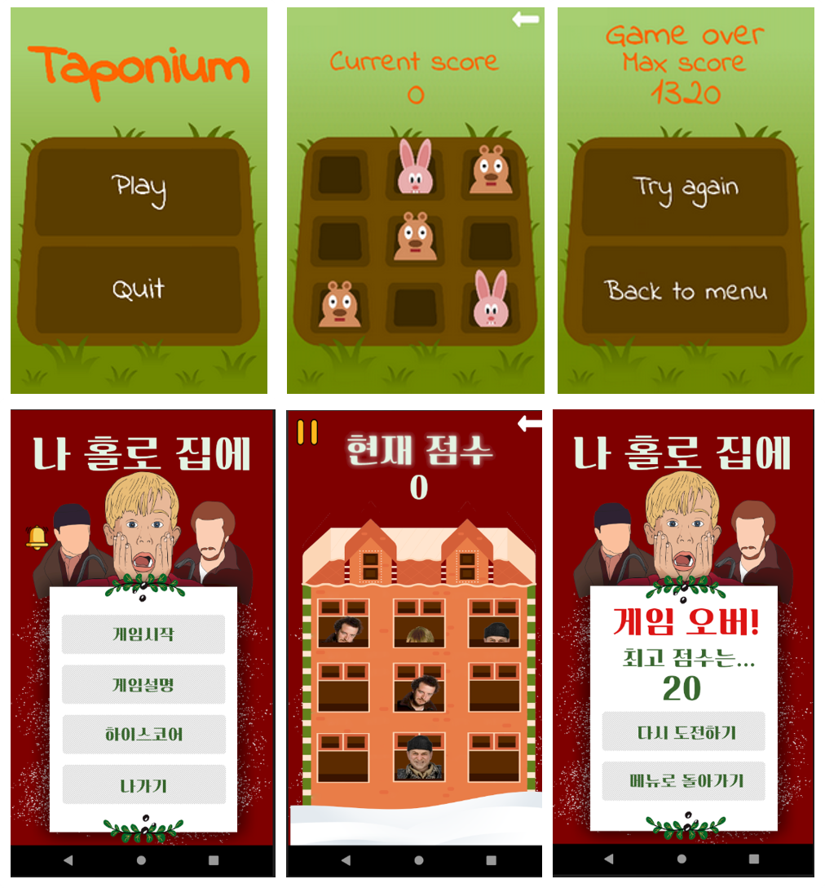

## Taponium - 나홀로집에 테마
간단한 터치반응형 아케이드 안드로이드 게임
- 보드에 무작위로 나타나는 도둑들을 최대한 많이 잡아야 함
- 잡은 도둑마다 10점을 얻고 놓칠 때마다 100점을 잃음.
- 케빈을 잡게 되면 1000점을 잃음
- 시간이 지날수록 속도가 빨라지며, 이에따라 점점 어려워짐
- 점수가 0점 아래로 떨어지면 게임이 종료됨

### Screenshots - 변경 전 후

### 변경사항

1. 리소스 변경 : 기존의 단순한 이미지를 영화 '나홀로집에'를 테마로 잡아 변경
2. 난이도 및 난이도 선택 씬 추가 : 기존의 하나의 난이도를 속도의 차이로 3단계로 나누고 선택하는 씬 추가
3. 일시정지 버튼 : 누르면 게임이 멈추고, 다시 누르면 재개되게끔 수정
4. 배경음악 추가 : 배경음악을 넣고, 켜고 끌 수 있는 버튼을 메인화면에 추가
5. 게임 설명 추가 : 기존에 게임 규칙 설명이 없어 설명하는 장면을 추가
6. 하이스코어 기능 추가 : 각 난이도 별로 최고점수를 3위까지 저장하여 볼수있는 화면 추가
7. 타임어택모드 추가 : 60초 시간 안에 가장 많은 점수를 얻어야하는 모드. 점수 대신 시간이 감소
8. 도둑 이미지 추가 : 기존 한가지 이미지를 2가지로 추가
9. 누르는 위치에 따라 이미지 변화

### 팀 구성
 - 김민준 : 배경음악 기능 구현, 리소스, 하이스코어, 난이도 등 구현 보조
 - 송치헌 : 난이도 기능 구현
 - 윤종명 : UML 분석, 일시정지, 누르는 위치에 따라 이미지 변화 기능 구현, 전체적인 기능 수정 및 디버그 담당
 - 이윤주 : 리소스 제작 및 디자인 담당
 - 이찬희 : 타임어택 기능 구현
 - 황효진 : 하이스코어 기능 구현

### Credits
Taponium uses Indie Flower font created by Kimberly Geswein and published under Open Font License.
